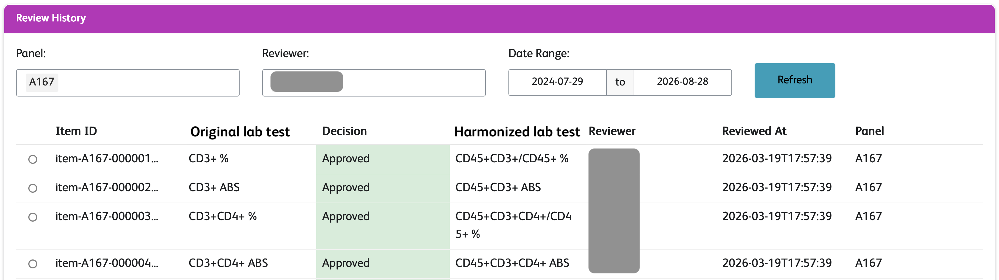

---
format:
  revealjs:
    theme: [simple, bms-reveal.scss]
    logo: assets/bms-logo.png
    slide-number: true
    width: 1280
    height: 720
    margin: 0.04  # default 0.04
    incremental: false
---


## Clinical data harmonization with LLMs {.title-hero background-image="assets/IMG_6706_2039.jpg" background-size="cover" background-position="right"}

:::: {.title-byline}
::: {.title-author}
Leslie Emery
:::
::::

<!-- 
To convert image from HEIC and strip location:
sips -s format jpeg -Z 3840 assets/IMG_6706_2039.heic --out assets/IMG_6706_2039.jpg && 
exiftool -gps:all= -overwrite_original assets/IMG_6706_2039.jpg
-->

::: {.notes}
- I'm a data scientist at the Seattle office of pharma co Bristol Myers Squibb (or BMS)
:::


## Clinical trial data is precious {.flip-bg background-image="assets/content-central/AdobeStock_158958915.jpeg" background-size="cover" background-opacity="0.75"}

::: {.absolute top="120" left="60" width="600" style="background: rgba(255, 255, 255, 0.7); padding: 8px 16px; border-radius: 12px; text-align: center;" .fragment}
[*How do a patient's pre-treatment biomarker levels affect their response to treatment?*]{style="font-size: 1.25em"}
:::

::: footer
Stock image
:::

::: {.notes}
- The data I work with is from clinical trials, mostly for cancer treatments
- The patients participating go through grueling treatments, visits that can be hours long, extra procedures that are sometimes painful, sometimes years of follow up visits 
- So this data is extremely precious and it's important to get every insight we can from this data for the benefit of these participants and other patients to come
- One way is to answer research questions to better understand treatments
- To answer this question we need to put together data from multiple trials
- And here's where things get difficult because the data from these trials is not in the same format, we need to harmonize it to use it together
:::


## Harmonization is necessary, but tedious & repetitive 



::: {.notes}
- Fancy way to say reformatting from multiple sources to be compatible
- Different subject ID formats, measurement units, date formats, inconsistent categorical values, synonyms for the same laboratory test
- Many files from many studies, custom code for each input file to output transformation, lots of variation in the code, lots of repeating the same kinds of things over and over again
- I'm going to tell you about using LLMs to simplify this in a way that's still reproducible
:::


## LLM-assisted data harmonization pipeline



```{=html}
<div class="fragment fade-out" data-fragment-index="8" style="position: absolute; left: 330px; bottom: 30px; font-size: 150px; line-height: 1;">👩🏻‍💻</div>
<div class="fragment fade-in"  data-fragment-index="8" style="position: absolute; left: 330px; bottom: 30px; font-size: 150px; line-height: 1;">🎉</div>
```

::: {.notes}
- There are 3 big pieces to this ...

- "runs harmonization logic to produce output datasets"

- Now only one set of steps that needs to be repeated for each dataset
- data model is a set of yaml format files that specificy exactly what your output should look like, variable names, definitions, data types, units, etc.

- harm configs ALSO a set of yaml files, one PER DATASET PER TRIAL, defining in detail the format of the original dataset so pipeline code can compare to data model and carry out appropriate transformations

- I've gone from complicated workflow with custom code for every dataset in every trial to a simplified workflow with repetitive work done by LLM

- While this project is very specific to my use case for clinical trial data, there are approaches you can use in other work and I'll call those out

- I'm going to go over the LLM-drafted steps and then show you how the pipeline code brings it together
:::


## Data model defines output format

::::: {.columns}

:::: {.column width="50%"}



::::

:::: {.column width="45%" .fragment}

Demographics data model


::::

:::::

::: {.notes}
- To produce one data model file, for example demographics
- I give PA explicit instructions for how to fill in fields of yaml based on 15 dataframes in R session
- Excerpt of the demographics data model produced this way
- Each object in the yaml is a variable in the output dataset
- Each variable has a set of required and optional attributes
- Use existing defintiions, not writing our own from scratch
:::


## Data model tracked in a GitHub repo



::: {.notes}
- Can be updated for adding datasets or adding/removing variables in datasets
- Also accommodates more complex datasets like my favorite, labs
:::


## Harmonization configs map trial data to data model

:::: {.columns}

:::: {.column width="30%"}


::::

::: {.column width="70%" .fragment}



:::

::::

::: {.notes}
- ... configs, which map original trial data to the output format described in data model

- Each object in the config yaml file is a variable from our data model and specifies which column from which input file to use
- And the the data type observed in our original data so we can compare that to the desired data type in our model in later steps

:::

## Pilot project insights

:::: {.columns}

::: {.column width="75%"}
[❶ Use [data dictionaries]{.bms-purple}, not actual data]{style="font-size: 2em; display: inline-block; margin: 1em 0.5em 0em;" .fragment}

[❷ LLMs and humans have different constraints]{style="font-size: 2em; display: inline-block; margin: 1em 0.5em 0em;" .fragment}
:::

::: {.column width="25%"}
{.nostretch fig-align="center"  style="display: inline-block; margin: 2em 0.5em;"}
:::

::::

::: {.notes}
- Now introduce Eslam, who did excellent work on a pilot project during internship
- Key things we found as a result of his work
- Data dictionaries -- simplification that makes it easier to have LLM work on these sometimes-large data files, reduces context requirements
- 

:::


## Harmonize a dataset with modular code + configs

[1. Transformations on one dataset file]{style="display: block; margin-left: 10%;"}


::: {.notes}
- We have data model, we have config files, now we put it together
- Modular harmonization code
- Some can be plain tidyverse code
- Some is in customized functions for performing more complex transformations
- These functions can be unit tested and reused without repeatedly re-writing code
:::


## Harmonize a dataset with modular code + configs

[2. Repeat for all datasets in the trial]{style="display: block; margin-left: 10%;"}


[3. Repeat for all trials]{style="display: block; margin-left: 10%; margin-top: 5%;" .fragment}

::: {.notes}
- Same harmonization code for every dataset
:::


## Harmonized data dictionary for free

:::: {.r-stack}

::: {.fragment .fade-out fragment-index="1"}



:::

::: {.fragment fragment-index="1"}



:::

::::

::: {.notes}
You get a great data dictionary for your output basically for free with the harmonization configs + data model

- Clear definition of final output data
- Links back to the input dataset + columns that were used
:::


## LLM-assisted data harmonization pipeline recap



::: {.notes}
- Now I've finished showing you the entire LLM-assisted harmonization workflow
- Now 2 things we're doing next to make it even better
:::


## Next: a Shiny app* for review

[\* internal only]{style="font-size: 0.7em; display: block; text-align: right;"}

::: {.absolute top="100" left="0" width="1280"}
{.nostretch width="100%" fig-align="left"}
:::

::: {.absolute top="450" right="30" width="190"}
{.nostretch width="100%" style="border: 4px solid #fff; border-radius: 6px; box-shadow: 0 2px 10px rgba(0, 0, 0, 0.35);"}
:::

::: {.notes}
- Make it easy for subject matter experts to help us review the config files and data model to make sure we're getting things right


:::


## Next: a Claude Code harmonization plugin*

:::: {.columns}

::: {.column width="75%"}



:::

::: {.column width="25%"}
[\* internal only]{style="font-size: 0.7em;"}

{.nostretch fig-align="center" style="display: inline-block; margin: 0.5em;"}
:::

::::

::: {.absolute bottom="-70" right="140" width="600" style="background: rgba(255, 255, 255); padding: 8px 16px; border-radius: 12px; text-align: center; border: 2px solid #4F4A4A;" .fragment}
[*How do a patient's pre-treatment biomarker levels affect their response to treatment?*]{style="font-size: 1.25em"}
:::

::: {.notes}
- working on taking this out of the coding assistant back and forth and making it into a Claude Code plugin that more computational scientists can use

- So it will be easy, even for a scientist who can't write a whole data pipeline on their own, to get back to our cross-trial research question to help patients
:::


## Takeaways

::: {style="width: 80%; margin-left:3em;"}
[Be flexible to rapid change]{.fragment style="font-size: 2em; display: inline-block; margin-top: 0.75em; margin-bottom: 0em;"}
[AWS Bedrock agent → langchain agent → Claude Code plugin]{.fragment style="font-size: 1em; display: inline-block; margin-top: 0.5em; margin-bottom: 0em; margin-left: 3em; color: #ADA599;"}

[Design with structured files]{.fragment style="font-size: 2em; display: inline-block; margin-top: 0.75em; margin-bottom: 0em;"}
[.yaml or .json or even .xml]{.fragment style="font-size: 1em; display: inline-block; margin-top: 0.5em; margin-bottom: 0em; margin-left: 3em; color: #ADA599;"}

[Look for data wrangling patterns]{.fragment style="font-size: 2em; display: inline-block; margin-top: 0.75em; margin-bottom: 0em;"}
:::

::: {.notes}
- Any project where you're combining data from multiple sources (e.g. COVID data from different health authorities, published datasets from different research groups, eCommerce data from acquired companies, etc.)

- Use data model .yaml to instruct LLM to make the output format you want
- Use a config file that describes all of your inputs (makes it easier for LLM to reason about your data)
- Specification-driven development
- See [`data-dict.yaml`](https://data-dict.tidyverse.org) from Tidyverse

- If you can make it into a function, you make it into a tool call an LLM can use and you can make it reproducible with a structured file
:::


## Acknowledgements {.no-bullets .no-title}

:::: {.columns}

::: {.column style="width: 25%; text-align: center;"}
#### Managers
- Garth McGrath
- Burak Kutlu
:::

::: {.column style="width: 25%; text-align: center;"}
#### Project team
- Jason Moore
- Clara Amorosi
- Mandeep Takhar
:::

::: {.column style="width: 25%; text-align: center;"}
#### Subject matter experts
- Begüm Topcuoglu
- José Malagon-Lopez
- Julie Rytlewski
:::

::: {.column style="width: 25%; text-align: center;"}
#### 2025 intern
- Eslam Abousamra
:::

{.nostretch width="40%" fig-align="center"}

::::

## Questions? {style="font-size: 100px;"}

:::: {.title-byline style="font-size: 40px;"}
::: {.title-author}
Leslie Emery
:::

::: {.title-affiliation}
linkedin.com/in/leslie-emery/
:::
::::
