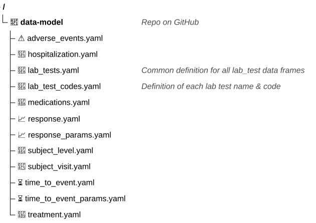

---
format:
  revealjs:
    theme: [simple, bms-reveal.scss]
    logo: assets/bms-logo.png
    slide-number: true
    width: 1280
    height: 720
    margin: 0.02  # default 0.04
    incremental: false
---


## Configurable clinical data harmonization with help from LLMs {.title-hero background-image="assets/IMG_6706_5704.jpg" background-size="cover" background-position="right"}

:::: {.title-byline}
::: {.title-author}
Leslie Emery
:::

::: {.title-affiliation}
Informatics & Predictive Sciences
:::
::::

<!-- 
To convert image from HEIC and strip location:
sips -s format jpeg -Z 3840 assets/IMG_6706_5704.heic --out assets/IMG_6706_5704.jpg && 
exiftool -gps:all= -overwrite_original assets/IMG_6706_5704.jpg
-->

::: {.notes}
- I'm a data scientist at the Seattle office of Bristol Myers Squibb (or BMS)
:::


## Clinical trial data is precious {.flip-bg background-image="assets/content-central/AdobeStock_158958915.jpeg" background-size="cover" background-opacity="0.75"}

::: footer
Stock image
:::

::: {.notes}
- I work with clinical trial data, mostly for cancer treatments
- Patients undergo extra procedures, visits that can be hours long, and sometimes years of follow up visits
- When their time was precious
- So it's important to use this data for as many scientific insights as possible to 

- Patient outcomes (overall survival, PFS)
- Adverse events
- Biomarkers
:::


## Cross-study analysis requires data harmonization

```{r}
#| echo: false
#| fig-width: 11
#| fig-height: 4.0
#| fig-align: center
# Clinical-trial timeline. Milestone dates extracted from
# bms-resources/study_milestone_dates_from_copilot.xlsx (gitignored), hardcoded
# here so the slide renders without that file. Ongoing studies (end date in the
# future) are drawn as arrows; completed studies get an end-date milestone.
library(ggplot2)
library(grid)

# karmma3: https://clinicaltrials.gov/study/NCT03651128    https://www.nejm.org/doi/pdf/10.1056/NEJMoa2213614
# pilot: https://clinicaltrials.gov/study/NCT03483103    https://www.thelancet.com/journals/lanonc/article/PIIS1470-2045%2822%2900339-4/fulltext
# breakfree: https://clinicaltrials.gov/study/NCT05869955
studies <- data.frame(
  study     = c("KarMMa-3", "PILOT", "Breakfree-1"),
  company   = c("Celgene", "Juno Therapeutics", "Bristol Myers Squibb"),
  disease   = c("Multiple myeloma", "B-cell lymphoma", "Autoimmune diseases"),
  treatment = c("Abecma®", "Breyanzi®", "CC-97540 (BMS-986353)"),
  start     = as.Date(c("2019-04-16", "2018-07-27", "2023-09-13")),
  end       = as.Date(c("2026-04-13", "2022-12-01", NA)),
  published = as.Date(c("2023-02-10", "2022-08-01", NA)),
  stringsAsFactors = FALSE
)
studies$ongoing <- is.na(studies$end) | studies$end > Sys.Date()  # no end = ongoing
studies$y <- max(rank(studies$start)) - rank(studies$start) + 1  # earliest on top

company_cols <- c("Celgene" = "#009FBA",
                  "Juno Therapeutics" = "#DF603A",
                  "Bristol Myers Squibb" = "#BE2BBB")

arrow_x <- as.Date("2029-03-01")
xlim <- c(as.Date("2018-01-01"), as.Date("2029-06-01"))  # must extend past arrow_x
ongoing   <- studies[studies$ongoing, ]
completed <- studies[!studies$ongoing, ]
published_df <- studies[!is.na(studies$published), ]

ggplot() +
  geom_segment(data = completed,
               aes(x = start, xend = end, y = y, yend = y, colour = company),
               linewidth = 1.6) +
  geom_segment(data = ongoing,
               aes(x = start, xend = arrow_x, y = y, yend = y, colour = company),
               linewidth = 1.6, lineend = "round", linejoin = "mitre",
               arrow = arrow(length = unit(0.5, "cm"), type = "open", angle = 20)) +
  # publication milestone: a diamond on the line + a label below it
  geom_point(data = published_df,
             aes(x = published, y = y - 0.1, colour = company),
             shape = "|", size = 4.5) +
  geom_text(data = published_df,
            aes(x = published, y = y - 0.3,
                label = paste0("Published ", format(published, "%b %Y")),
                colour = company),
            size = 2.9, vjust = 1) +
  geom_text(data = studies,
            aes(x = start, y = y + 0.4, label = paste0(study, "  —  ", treatment),
                colour = company),
            hjust = 0, fontface = "bold", size = 4.4) +
  geom_text(data = studies,
            aes(x = start, y = y + 0.2, label = paste0(disease, "  ·  ", company)),
            hjust = 0, colour = "grey35", size = 3.5) +
  geom_label(data = studies,
             aes(x = start, y = y, label = format(start, "%b %Y"), colour = company),
             fill = "white", size = 3.5, fontface = "bold",
             linewidth = 0.6, label.r = unit(0.45, "lines")) +
  geom_label(data = completed,
             aes(x = end, y = y, label = format(end, "%b %Y"), colour = company),
             fill = "white", size = 3.5, fontface = "bold",
             linewidth = 0.6, label.r = unit(0.45, "lines")) +
  scale_colour_manual(values = company_cols) +
  scale_x_date(date_breaks = "1 year", date_labels = "%Y",
               limits = xlim, expand = expansion(mult = c(0.01, 0.01))) +
  coord_cartesian(ylim = c(0.55, 3.85), clip = "off") +
  theme_minimal(base_size = 15) +
  theme(
    panel.grid.major.y = element_blank(),
    panel.grid.minor = element_blank(),
    panel.grid.major.x = element_line(colour = "grey95"),
    axis.title = element_blank(),
    axis.text.y = element_blank(),
    axis.text.x = element_text(colour = "grey30"),
    axis.ticks = element_blank(),
    legend.position = "none",
    plot.margin = margin(12, 24, 8, 12)
  )
```

<!--
Can I make this music/harmony related somehow?
-->

::: {.notes}
- To get every last insight we can from the data, we need to harmonize it
- Different subject ID formats, measurement units, date formats, inconsistent categorical values, synonyms for the same laboratory test
- "combining different datasets to maximize their comparability and compatibility" -- A general primer for data harmonization. Cheng et al. 2024. Sci Data.
:::


## Data harmonization is tedious and repetitive



<!-- Like a middle school band where everyone is trying really hard, but going in their own directions -->

::: {.notes}
- And historically this has been a very complicated and involved process, with lots of manual QC
    - big, complicated diagram
- Many files from many studies, custom code for each input file to output transformation, lots of variation in the code, lots of repeating the same kinds of things over and over again
- Choices of common format might not be the same from harmonization project to harmonization project
- "I'm going to tell you about how I went from this [complicated diagram] to this [simple diagram]"
:::


## My configurable workflow with LLM assistance is better, faster

<!-- Like a string quartet? -->



::: {.notes}
I built out this workflow based on my deep expertise in data harmonization

- match input columns to desired output columns
- figure out what format it's in
- convert it to the format you want it to be
- Overview of some example data from 3 studies (real column names, but not real data)

Data model:

- 🏛️ Columns to include
- 🔑 Primary key(s)
- 📖 Data definition
- 🔢 Data type
- 🏷️ Categorical values
- ❓ Missing value codes
- 📏 Unit of measure

Harmonization configs:

- observed data type, categorical values, missing value codes, units of measure
:::

## The data model specifies the output format in detail

:::: {.columns}

::: {.column width="50%"}

```{r}
#| include: false
# Render the TreeView diagram to SVG with mermaid-cli.
# Requires mmdc (@mermaid-js/mermaid-cli) with bundled mermaid >= 11.14.0 for treeView-beta.
system("mmdc -i data-model-directory-treeView.mmd -o assets/data-model-directory-treeView.svg -b transparent")
```

<div style="position: relative;">

{width=100%}

<!-- Highlight boxes overlaid on mermaid (BMS theme colors, not purple) -->
<div style="position: absolute; top: 45%; left: 4%; width: 90%; height: 12%; border: 2px solid #496FE3; border-radius: 4px; background: rgba(73, 111, 227, 0.12);"></div>
<div style="position: absolute; top: 58%; left: 4%; width: 90%; height: 12%; border: 2px solid #2CF1B1; border-radius: 4px; background: rgba(44, 241, 177, 0.15);"></div>
<div style="position: absolute; top: 83%; left: 4%; width: 90%; height: 12%; border: 2px solid #A9FA17; border-radius: 4px; background: rgba(169, 250, 23, 0.15);"></div>

</div>

:::

::: {.column width="50%"}
```yaml
# Each terminal node is a data frame expected
# in the output
data_structure:
    - adverse_events
    - concomitant_medications
    - exposure
    - hospitalization
    - lab_tests:
        - albumin
        - CD3
        - CD4
        - CRP
        - kappa_flc
        - lambda_flc
        - ...
    - response:
        - best_overall_response
        - overall_response
    - subject_level
    - subject_visit
    - time_to_event:
        - duration_of_response
        - event_free_survival
        - progression_free_survival
        - time_to_progression
```
:::

::::


::: {.notes}
:::


## Bootstrap the initial data model with Posit Assistant

::::: {.columns}

:::: {.column width="50%"}
::: {.small-quote}
> The subject_level_labels object contains a data dictionary for each data frame in subject_level_sources. The project goal is to harmonize the data across all of these studies, whether the data comes from the sdtm dm file or the adam adsl file. Reviewing all of the variables described in the data dictionaries, come up with a list of the variables that should be in the harmonized dataset. Substantially similar variables should be combined into just one variable for simplicity. Use meaningful snake case variable names based on the descriptions from the data dictionaries. Only include a variable in the harmonized dataset if a similar variable is present in at least 3 of the studies.

> Make this into a yaml format file named subject_level.yaml (saved in this workspace) that matches the format in example.yaml. Each item in the yaml is a variable and unique variable names from the individual source datasets are stored as a list in the inputs attribute. The data_type should be the R data type that most closely aligns with the input variables that will contribute to the harmonized variable. Ignore other attributes from the example for now.
:::
::::

:::: {.column width="50%"}

### `subject_level` data model

```yaml
unique_subject_id:
  key: true
  data_type: character
  character_pattern: ^[A-Z0-9-]+-\d+-\d+$
  inputs:
      USUBJID
site_id:
  data_type: character
  character_pattern: ^\d+$
  inputs:
  - SITEID
  - SITE_ID
baseline_height_cm:
  data_type: numeric
  numeric_units: centimeter
  inputs:
  - HTCMBL
  - HEIGHTBL
  terms:
    loinc: 8302-2
    snomed: C0005890
diagnosis_date:
  data_type: Date
  date_format: "%Y-%m-%d"
  inputs:
  - DIAGDT
  - DIAGDTC
  - DXDT
actual_arm:
  data_type: factor
  factor_allowed_values:
    - Arm A
    - Arm B
    - Arm C
  inputs:
  - ACTARM
```
::::

:::::

<!-- Build this out to highlight all variable names, then all data types, then all type-specific values, then the inputs, etc. -->
::: {.notes}
Data model (output)

- Show prompt to get Posit Assistant to make the data model based on a group of studies
- Show example data model
    - Structure:
        - _structure.yaml file; domain.yaml for each domain included
    - Domains: adverse_events, exposure, subjects, lab_tests, time_to_event, response
- Future: add mapping to existing terminologies for data definitions so we're not writing new data definitions from scratch
:::

## Harmonization configs match observed data to the data model

:::: {.columns}

::: {.column width="50%"}
```yaml
unique_subject_id:
  - {file: dm, column: subject_id, data_type: character}
  - {file: adsl, column: USUBJID, data_type: character}
site_id:
  - {file: dm, column: SITE_ID, data_type: character}
  - {file: adsl, column: SITE, data_type: character}
baseline_height_cm:
  - {file: adsl, column: HEIGHTBL, data_type: numeric, numeric_units: inch}
diagnosis_date:
  - {file: dm, column: DIAGDTC, data_type: character}
actual_arm:
  - {file: dm, column: study_arm, data_type: character}
  - {file: adsl, column: ACTARMCD, data_type: character}
```
:::

::: {.column width="50%"}
```yaml

```
:::

::::

::: {.notes}
Harmonization configs (input)

- Show example from subjects domain for 3 different studies
- Include baseline height since it will include unit conversion and type conversion
- For each desired output column:
    - Which dataset & column to get it from
    - What data type is it
    - What units is it already in
    - What categorical values exist
- Mention relation to data dictionary? (of recent interest in field)
:::

## When the simplest example isn't

<!-- Include photo of Eslam -->

::: {.notes}
- Side story here about me telling Eslam to start with dm file, but it turned out to be most difficult
:::

## Config-based harmonization code

```r
derive_subject_level <- function(){
  
  # Get the set of columns to be included in the output
  domain_spec <- read_daap_specification("subject_level")
  
  # Get the harmonization config
  domain_config <- read_harmonization_config("subject_level")
  domain_config_df <- harmonization_config_to_tibble(domain_config)
  
  # Which columns need to be in the output?
  expected_keys <- purrr::map_chr(domain_spec$keys, .f=names)
  expected_keys_and_columns <- c(expected_keys,
                                 purrr::map_chr(domain_spec$columns, .f=names))
  
  # Use the harmonization config to find the source data for each column
  domain_config_df <- domain_config_df %>% 
    mutate(
      preferred_file = case_when(
        "adsl" %in% file ~ "adsl",
        TRUE ~ first(file)
        ),
        .by=output_column
    )
  
  # Get the mapped columns from each source file
  get_mapped_data <- function(source_file){  # source_file <- "dm"
    input_type <- ifelse(source_file %in% names(data_files_read$adam), "adam", "sdtm")
    source <- data_files_read[[input_type]][[source_file]](config=config)
    source_map <- domain_config_df %>%
      filter((preferred_file == source_file | output_column %in% expected_keys ) &
               file == source_file)
    rename_map <- source_map$column
    names(rename_map) <- source_map$output_column
    mapped_data <- source %>% 
      select(all_of(source_map$column)) %>% 
      rename(all_of(rename_map))
  }
  subject_level <- purrr::map(unique(domain_config_df$preferred_file), .f=get_mapped_data)
  subject_level <- purrr::reduce(subject_level, .f=full_join)   # running this for each split of response

  return(subject_level)
}
```

::: {.notes}
Config-based harmonization code

- Show code snippets from subjects domain
- Fully working for simple case of just renaming columns and converting data types
- Still to handle (should I mention this or not?):
    - Converting units
    - Harmonizing categorical values
:::

## The harmonization config files maximize human attention/time spent reviewing LLM output

::: {.notes}
The harmonization config files maximize human attention/time spent reviewing LLM output

- The configs capture the most important parts of the harmonization decisions -- which inputs map to which outputs, and what data transformations happen
- Screenshot of the review app Burak has built
:::

## You get a great data dictionary for your output basically for free with the harmonization configs + data model

::: {.notes}
You get a great data dictionary for your output basically for free with the harmonization configs + data model

- Clear definition of final output data
- Links back to the input dataset + columns that were used
:::

## We've done this in a pilot project and it gets us pretty close to final state so we can focus our time on the hard parts

::: {.notes}
We've done this in a pilot project and it gets us pretty close to final state so we can focus our time on the hard parts

- Mention Burak's Shiny app for human review
:::

## We are building out a Claude Code plugin using our daapr framework

::: {.notes}
We are building out a Claude Code plugin using our daapr framework

- Mention Jason for plugin
- Show plugin workflow design
- Mention things are moving so fast we've had several different plans for this -- AWS Bedrock agent, then langchain agent, now Claude Code plugin
:::

## You can use these approaches for other use cases

::: {.notes}
You can use these approaches for other use cases

- Any project where you're combining data from multiple sources (e.g. COVID data from different health authorities, published datasets from different reserach groups, eCommerce data from acquired companies, etc.)
- Use data model .yaml to instruct LLM to make the output format you want
- Use a config file that describes all of your inputs (makes it easier for LLM to reason about your data)
:::


## Acknowledgements

<!-- Image of a conductor with an orchestra here? -->

:::: {.columns}

::: {.column width="33%"}
#### Managers
- Garth McGrath
- Burak Kutlu
:::

::: {.column width="33%"}
#### Project team
- Jason Moore
- Clara Amorosi
- Mandeep Takhar
:::

::: {.column width="33%"}
#### 2025 intern
Eslam Abousamra, MPH

PhD student at CUNY Graduate School of Public Health and Public Policy
:::

::::